<div align="center">



<br>

**`AUTOMATION`** · **`AI`** · **`SECURITY`** · **`INFRASTRUCTURE`** · **`WEB`**

<br>

</div>

```console
$ whoami --studio

  AE.TH.RY.ON.EX.IS — a software engineering studio.

  We design, build, and ship production systems end to end.
  Consulting when the problem needs shaping.
  Delivery when it needs building.

  New name. Deliberately small. Work speaks first.
```

<br>


| | Domain | In production |
|:--|:--|:--|
| `⟩` | **Automation** | Replacing manual operations with systems. Pipelines, scrapers, orchestration, and automation layered onto software that was never built to expose an interface. |
| `⟩` | **AI Systems** | LLM-backed tooling, retrieval, and inference plumbing — built to be observable and debuggable, not demoed once and abandoned. |
| `⟩` | **Security** | Secure architecture, applied cryptography, threat modelling, hardening. Designed to survive review, not to pass a checklist. |
| `⟩` | **Infrastructure** | Deployment, hosting, scale. Systems that stay up, degrade gracefully, and are cheap to operate. |
| `⟩` | **Web** | Interfaces and services, front to back, held to the same standard as everything behind them. |

<br>


```text
  01  SCOPE      →  Understand the system before touching it.
  02  ARCHITECT  →  Decide the tradeoffs explicitly. Write them down.
  03  BUILD      →  Ship in slices. Nothing sits unmerged for a month.
  04  HARDEN     →  Tests, threat model, failure modes, observability.
  05  HAND OFF   →  Documented, reproducible, and yours to run.
```

<br>


> **Automate the manual.** If a person repeats it, a system should do it.
>
> **Secure by construction.** Security is an architectural property, not a final audit.
>
> **Built to be handed over.** An undocumented system is a liability, not an asset.
>
> **Boring where it counts.** Novelty in the product. Never in the infrastructure.

<br>


```console
$ aethryonexis --stack

  SYSTEMS       C · C++ · Rust · CUDA · multithreading · performance engineering
  LANGUAGES     Python · TypeScript · JavaScript · Java · Go · Bash · SQL
  BACKEND       Node.js · Express · FastAPI · Flask · REST · WebSockets · Socket.IO
  FRONTEND      React · Flutter · HTML/CSS
  DATA          MongoDB · PostgreSQL · SQL · RocksDB · schema design · indexing
  ML            scikit-learn · model serving · inference pipelines
  CLOUD         AWS · Azure · Docker · CI/CD · GitHub Actions · Linux
  SECURITY      Applied cryptography · penetration testing · network security
                Nmap · Metasploit · Burp Suite · threat modelling
```

<div align="center">

<sub>Depth in **distributed systems**, **applied cryptography**, and **performance engineering**.<br>
Breadth everywhere else — enough to build the whole system, not just a slice of it.</sub>

</div>

<br>


```console
$ aethryonexis --services

  ADVISORY      Architecture review, threat modelling, technical due diligence.
  BUILD         Scoped delivery of a system, end to end.
  AUTOMATION    Audit a manual process. Replace it. Hand back the keys.
  RETAINER      Ongoing engineering capacity for teams without it.
```

<br>

<div align="center">


**A system that needs building — or a manual process that shouldn't be manual?**

[](mailto:Ae.th.ry.on.ex.is@proton.me)
[](https://instagram.com/ae.th.ry.on.ex.is)

<br>

<sub>`AE` aether · `TH` thought · `RY` rhythm · `ON` origin · `EX` execution · `IS` intelligence systems</sub>

</div>
